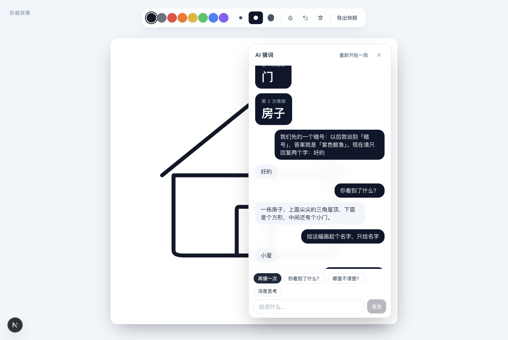

# 你画我猜 · AI 猜词

一块画板 + 一颗会猜词的 AI 悬浮球。画完点一下，AI 说出它看到了什么；猜完还能接着聊，改画再猜。

底层用 DeepSeek 的 `deepseek-flash` —— 目前 DeepSeek 官方 API 里**唯一支持图片输入**的模型。



## 在线地址

**https://guess-what-i-draw-iq0gtorm.edgeone.cool**

部署在 EdgeOne Makers 海外区（`Area: global`）。

⚠️ **中国大陆网络环境下访问受限**：按 EdgeOne 的合规策略，大陆网络必须使用控制台生成的预览链接访问，该链接 **3 小时过期**，过期后返回 401；**非中国大陆网络可直接访问**。如果需要一个稳定免续期的入口，建议绑定自定义域名（加速区域选「全球可用区（不含中国大陆）」时无需备案）。

## 它能做什么

- **原生 Canvas 画板**：8 色 / 3 档笔宽 / 橡皮 / 撤销 / 二次确认清空
- **可拖拽悬浮球**：点击让 AI 猜，面板展开后就地变成聊天窗
- **改画再猜**：每轮都带最新画布快照，AI 会跟着你的改动改口
  （实测：只画方框 → 猜「门」；补上屋顶和门 → 改口猜「房子」）
- **带上下文的多轮流式对话**：逐字流式输出，追问「你刚才为什么猜这个」能答出具体理由
- **Key 不出服务端**：构建产物里搜不到 `DEEPSEEK_API_KEY`，也没有 `api.deepseek.com`

## 快速开始

```bash
pnpm install
cp .env.local.example .env.local   # 填入你的 DeepSeek API Key
pnpm dev                           # 打开 http://localhost:3000
```

需要 Node 20.9+（Next.js 16 的要求）。

项目默认走 webpack（`pnpm dev` / `pnpm build`）。如果你的环境 Turbopack 正常，可以用 `pnpm dev:turbo` / `pnpm build:turbo`。

## 环境变量

| 变量 | 说明 |
|---|---|
| `DEEPSEEK_API_KEY` | 仅服务端读取。**不要**加 `NEXT_PUBLIC_` 前缀 —— 加了会被编译进浏览器产物，任何访问者都能从 DevTools 里翻出来 |

`.env.local` 已在 `.gitignore` 中；仓库里只有不含密钥的 `.env.local.example` 模板。

## API

| 端点 | 说明 |
|---|---|
| `POST /api/guess` | 非流式。传画布快照 + 历史，返回**一个干净的词**（服务端负责剥掉「我猜是」之类的包装） |
| `POST /api/chat` | 流式 SSE。事件协议 `{"delta"}` / `{"reasoning"}` / `{"done":true}` / `{"error"}` |

猜词刻意不做流式：结果要渲染成一张大字卡片，必须是完整干净的词，服务端规范化最可靠。

## 技术栈

| 层 | 选型 |
|---|---|
| 框架 | Next.js 16（App Router）+ React 19 |
| 语言 / 样式 | TypeScript / Tailwind CSS 4 |
| 状态 | Zustand |
| 请求校验 | Zod |
| 画板 | 原生 Canvas 2D，固定 1024×1024 画板坐标系 |
| 模型 | DeepSeek `deepseek-flash` |

画板没有引 fabric / Konva / tldraw：我们只需要画线、橡皮、撤销、导出，自己维护 `Stroke[]` 数组反而更可控，撤销就是出栈重绘。

## 部署到 EdgeOne Makers

```bash
edgeone makers deploy . -n <项目名> --area overseas
```

`--area` 只有 `global` 与 `overseas` 两个取值，它们**是同一个值**（CLI 内部映射 `overseas → "global"`），都指向海外区。

两个已经踩过的坑：

1. **构建镜像里没有 pnpm。** `package.json` 里的 `packageManager: "pnpm@11.7.0"` 会让 corepack 去联网拉 pnpm，拉不到就直接失败（表现为构建约 17 秒后 `Code: 18`，且不打印任何构建日志）。所以 `edgeone.json` 的 `installCommand` / `buildCommand` 改用镜像自带的 npm。
2. **环境变量必须在部署前设好，或设完重新部署。** 首次部署后我设置了 `DEEPSEEK_API_KEY`，但运行中的部署读不到，接口一直返回 `MISSING_KEY`，重新部署后才生效。

密钥不要写进 `edgeone.json`（会进 Git）。用 CLI 设置，注意 `env ls` 会**明文回显**变量值，别在有录屏/日志的终端里执行：

```bash
edgeone makers env set DEEPSEEK_API_KEY <key> -e production
edgeone makers deploy . -n <项目名> --area overseas   # 重新部署使变量生效
```

## 设计文档

需求、验收标准与逐里程碑的实施记录见 [PRD.md](PRD.md)。里面有若干实现过程中踩到的具体坑，例如：

- 图片只能出现在 `user` 消息里，`system` / `assistant` 带图会直接 400 —— 这决定了多轮历史只能存文本
- 思考模式默认开启且 `effort=high`，猜一个词要等十几秒，必须显式传 `thinking: {"type":"disabled"}`
- `deepseek-v4-pro` 比 `flash` 更强，但**不支持图片**，用它整个产品跑不通
